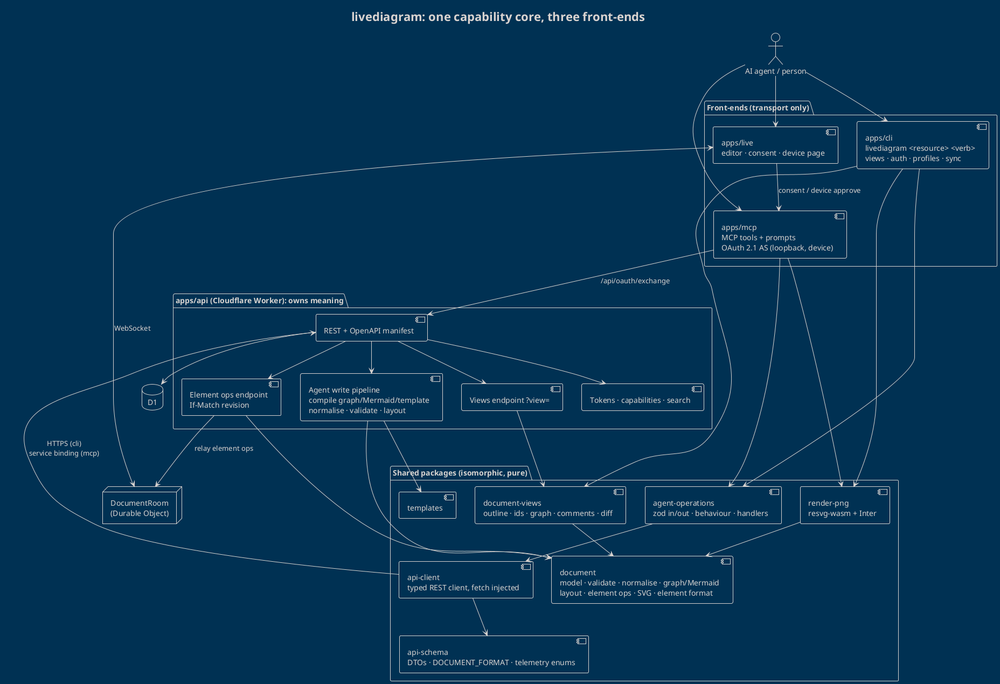

# One core, many front-ends: REST, MCP and CLI

Research for the agent-first `livediagram` CLI. Angle: how one capability core serves the REST API, the MCP server and a CLI without drift, and how the CLI is authenticated, distributed, updated, measured and self-hosted. Measured against the code on `main` at `efaee7d29`.

Specs read: [MCP server](../../specs/015-api/mcp-server.md), [Public API and API tokens](../../specs/015-api/public-api-and-tokens.md), [API app](../../specs/015-api/api.md), [Telemetry](../../specs/017-telemetry/telemetry.md).

## 1. Recommendation in one screen

- **The server owns meaning.** Everything that decides what gets _stored_ (graph and Mermaid to elements, normalisation, layout choice, template materialisation, element ops, validation) runs in the **api worker**, behind REST. MCP and CLI stop computing writes and become adapters. This is the only placement that survives version skew: an installed CLI from March cannot store elements the way the October server expects, but it can always ask the server to.
- **Packages own presentation.** Read views (outline, ids, graph, comments, diff) are **pure functions in a new `@livediagram/document-views` package**, served by the api as `?view=` text **and** bundled in the CLI for local files. Online, the CLI prefers the server's rendering; offline (synced files) it renders locally and says which format version it understood.
- **Front-ends own transport.** One **operation catalogue** (`@livediagram/agent-operations`: zod input and output, fact-only descriptions, behaviour preset, handler against a typed api client) is registered by `apps/mcp` as tools and by `apps/cli` as commands. PNG rasterisation stays at the edge (resvg-wasm in both), because it is stateless and presentational.
- **Auth reuses the token.** `LIVEDIAGRAM_TOKEN` for agents and CI; `livediagram auth login` runs the **existing OAuth 2.1 + PKCE server** in `apps/mcp/src/oauth.ts` with a loopback redirect (needs RFC 8252 port-agnostic loopback matching), with **device code** (RFC 8628) as the headless path. The result is an ordinary `lvd_` token.
- **Distribution**: an npm package `livediagram` (name free on npm today, as is `@livediagram/cli`), bundled to one ESM file plus the resvg wasm and the Inter font, `npx livediagram@latest` on Node >= 22. Bun-compiled single binaries on GitHub Releases and a Homebrew tap come second.
- **The largest gap is not the CLI.** A REST tab write is last-writer-wins with no revision check and tells the realtime room nothing (`docs/specs/015-api/api.md`: "a write from any other caller reaches connected peers only when they next load the tab"). A chat agent editing while a person watches the canvas is exactly that case. The `ops` endpoint with `If-Match` and room relay (§9) is the most important API addition, for MCP as much as the CLI.

## 2. What the code is today (an honest map)

### 2.1 `apps/mcp/src`

| File                                                                   | Lines | What it is                                                                                                             | Verdict                                                                                                                                                                                |
| ---------------------------------------------------------------------- | ----- | ---------------------------------------------------------------------------------------------------------------------- | -------------------------------------------------------------------------------------------------------------------------------------------------------------------------------------- |
| `tools.ts`                                                             | 644   | 11 tool handlers: arg juggling, api calls, ops apply, layout, normalise, render                                        | **Split.** The write logic (ops apply, validate, layout, land arrivals) moves server-side; the rest becomes catalogue entries                                                          |
| `graph-input.ts`                                                       | 181   | Label cap (`GRAPH_LABEL_MAX` 40), layout style and direction choice, line routing, Mermaid dispatch                    | **Move** to `packages/document` (pure; only imports `@livediagram/document`). It is authoring policy, not MCP policy, once a CLI shares it                                             |
| `element-normalise.ts`                                                 | 178   | Factory defaults, table padding, code language coercion, entity height, chart coercion, lanes to front, stroke packing | **Move** to `packages/document` (pure). The api worker should run it on every agent write path                                                                                         |
| `tab-builders.ts`                                                      | 140   | `applyLayout`, `buildTab` (theme paint), `buildGraphTab`, `buildTemplateTab`, `landMcpArrivals`                        | **Move** to `packages/document` + `packages/templates` (pure; already render-free by design)                                                                                           |
| `schema.ts`                                                            | 469   | Element format text (`ELEMENT_SCHEMA_HINT`, `elementSchemaDoc`) **and** zod input shapes                               | **Split.** The format text moves to `packages/document` (`element-format.ts`) so `livediagram schema`, the api and MCP read one copy; zod shapes move to the catalogue                 |
| `output-schema.ts`                                                     | 148   | zod output schemas per tool                                                                                            | **Move** to the catalogue                                                                                                                                                              |
| `find-documents.ts`                                                    | 72    | Personal + team library sweep, name match, ranking                                                                     | **Move server-side** as `GET /api/documents?query=` (one round trip instead of 2 + N teams)                                                                                            |
| `tool-annotations.ts`                                                  | 110   | `registerTool` wrapper: required behaviour + outputSchema, telemetry, legacy names                                     | **Stays** (MCP adapter); reads behaviour from the catalogue                                                                                                                            |
| `tool-helpers.ts`, `tool-scope.ts`, `request-scope.ts`                 | ~120  | Result shaping, token guard, AsyncLocalStorage scopes                                                                  | **Stays** (MCP adapter)                                                                                                                                                                |
| `api.ts`                                                               | 103   | Service-binding fetch, `ApiError`, 5xx telemetry                                                                       | **Generalise** into `@livediagram/api-client` with an injected `fetch` (service binding in the worker, global `fetch` in the CLI)                                                      |
| `render.ts`, `image-result.ts`                                         | 106   | resvg-wasm + embedded Inter, image prefetch                                                                            | **Extract** the rasteriser to `@livediagram/render-png` (wasm init injected: Worker `Data` module vs Node `readFile`); image prefetch already sits on `embedTabImages` in `api-schema` |
| `oauth.ts`                                                             | 278   | OAuth 2.1 AS: discovery, DCR, authorize, session read, token                                                           | **Stays in `apps/mcp`** for now; two changes for the CLI (§6). Becomes `@livediagram/oauth-server` only if a second host appears                                                       |
| `prompts.ts`, `server.ts`, `legacy-tool-names.ts`, `created-folder.ts` |       | MCP-only                                                                                                               | **Stays**                                                                                                                                                                              |

### 2.2 `packages/*`

- `@livediagram/document` is already the isomorphic core: types, `isValidTab`, `autoLayoutElements`, `graphToElements` (`graph-authoring.ts`, whose header already says "the public API can adopt it"), `parseMermaid`, `mermaid-serialise.ts` (elements to Mermaid), `renderElementsToSvg`, `element-ops.ts` (`diffToElementOps`, `applyElementOp`), `element-deltas.ts`, `comments.ts`, `element-display-label.ts`, `element-kind-label.ts`. Nothing in it touches the DOM. It is the right home for the moved MCP logic.
- `@livediagram/api-schema` holds the wire DTOs, `DOCUMENT_FORMAT` (2) and its header `X-Livediagram-Format`, `BUILD_ID_HEADER`, telemetry enums, `embedTabImages`, `bearerTokenOf`, `isLoopbackHostname`. The CLI consumes it unchanged.
- `@livediagram/templates` and `@livediagram/icons` (`/resolve`) are pure and Worker-safe; both bundle into Node as is.
- **One piece lived in the wrong app:** `tabToMarkdownText` (the Markdown outline) was in the editor app. It is the seed of the outline view; it now lives in `packages/document/src/export-tab-text.ts`, and the outline view itself in `document-views`.
- **Packaging fact that shapes distribution:** every internal package is `private` and exports raw TypeScript (`"main": "./src/index.ts"`). Nothing can be published as is; the CLI must be **bundled** (esbuild / tsdown) so internal packages are inlined. Source size: `document` 2.8 MB, `templates` 800 KB, `icons` 280 KB of TS, tree-shaken in the bundle.

### 2.3 `apps/api` facts that matter

- `GET /api/openapi.json` comes from a hand-declared route manifest (`apps/api/src/openapi/manifest.ts`, 113 paths, 46 marked `tokenUsable`) with component schemas generated from `api-schema` types, pinned to real dispatch by `route-parity.test.ts`. A generated CLI could start from it, but the agent-relevant smarts are not in it.
- `PUT /documents/:id/tabs/:tabId` stores the whole tab. No `ETag` / `If-Match`. A body without `X-Room-Cursor` (every token caller) skips the ledger merge. No room relay. A personal, unshared, team-less document has **no room at all** (`roomStubFor` in `room-client.ts`).
- Comments: `POST …/comments` (add, relayed to the room as an `el-delta`) and `DELETE …/comments/:commentId`. No reply, resolve or reopen route; those happen today only through a whole-tab PUT.
- No identity endpoint for a token (`/me`), no self-revoke (`/api/tokens` is Clerk-session-only by design), no server-side search.
- `GET /api/capabilities` exists, unauthenticated, fail-closed: the natural discovery point for a CLI against an unknown host.

## 3. How others serve one capability through many front-ends

| Vendor                    | CLI                                                                             | MCP                                                                                                                          | Shared core?                                                                                          | Lesson for us                                                                                                                                                                                     |
| ------------------------- | ------------------------------------------------------------------------------- | ---------------------------------------------------------------------------------------------------------------------------- | ----------------------------------------------------------------------------------------------------- | ------------------------------------------------------------------------------------------------------------------------------------------------------------------------------------------------- |
| **GitHub**                | `gh` (Go)                                                                       | `github-mcp-server` (Go), separate repo                                                                                      | No shared command layer; both are clients of REST/GraphQL via go-github. `gh api` is the escape hatch | Two hand-written front-ends drift (toolsets vs commands differ). The escape hatch `gh api` is invaluable for agents; ship `livediagram api <path>`                                                |
| **Stripe**                | Stripe CLI (Go)                                                                 | Hosted MCP + `@stripe/agent-toolkit` (TS)                                                                                    | The **API** is the core; toolkit and MCP are thin, OpenAPI-informed adapters                          | Keep every smart thing behind the API; front-ends stay thin                                                                                                                                       |
| **Cloudflare**            | `wrangler` (TS)                                                                 | Many MCP servers; **Code Mode** ("entire API in ~1,000 tokens": two tools, `search()` and `execute()`, over 2,500 endpoints) | OpenAPI is the core; Code Mode turns it into a typed surface the model writes code against            | For a large surface, progressive discovery beats a long tool list. Our surface is small, so per-command help is enough; keep the idea for `livediagram api`                                       |
| **Supabase**              | `supabase` (Go)                                                                 | `supabase-mcp` (TS) over the Management API                                                                                  | API is the core                                                                                       | Same as Stripe                                                                                                                                                                                    |
| **Vercel**                | `vercel` (TS)                                                                   | Hosted MCP                                                                                                                   | API is the core                                                                                       | OAuth for MCP, separate login for CLI: two front doors to one credential                                                                                                                          |
| **Linear**                | none official                                                                   | Hosted MCP                                                                                                                   | API (GraphQL)                                                                                         | An MCP can be the only agent surface; but agents in a repo still reach for a CLI                                                                                                                  |
| **Sentry**                | `sentry-cli` (Rust)                                                             | `sentry-mcp` (TS)                                                                                                            | API                                                                                                   | Language split guarantees duplication                                                                                                                                                             |
| **Stainless / Speakeasy** | Generated CLIs (Stainless CLI generator GA; Speakeasy generates a Go/Cobra CLI) | Generated MCP servers                                                                                                        | **OpenAPI** generates SDK, CLI and MCP                                                                | Works when the API _is_ the capability. Ours is not yet: the smart parts live in the MCP worker, so generating from today's OpenAPI would yield a CLI without graph input, normalisation or views |
| **incur** (wevm, 0.7)     | Schema-defined TS CLIs                                                          | The same commands served over MCP (stdio and HTTP), `--llms` manifest, TOON output                                           | **One zod command definition** feeds CLI, MCP and OpenAPI                                             | The closest match to our goal; pre-1.0 and opinionated (its own MCP gating, TOON default). Borrow the ideas, not the dependency (§5.3)                                                            |

**The pattern that does not drift** is "the API is the capability; every front-end is a thin, generated or catalogue-driven adapter". Every vendor whose CLI and MCP feel consistent has the logic behind the API. Where logic sits in a front-end (our MCP today), a second front-end means a second copy or a shared library pinned to the client's install date.

## 4. Where the core runs: four options

|              | A. CLI is an MCP client                                               | B. Fat client (CLI bundles the MCP logic)                                          | C. Server-side core, thin front-ends                          | D. Generated from OpenAPI                                  |
| ------------ | --------------------------------------------------------------------- | ---------------------------------------------------------------------------------- | ------------------------------------------------------------- | ---------------------------------------------------------- |
| Shape        | `livediagram` speaks MCP to `mcp.livediagram.app`                     | `apps/cli` imports the same packages the MCP worker does and computes locally      | api gains the agent endpoints; MCP and CLI call them          | Stainless / Speakeasy / openapi-to-mcp over `openapi.json` |
| Drift        | None (one implementation)                                             | Low for code, **high for installs**: logic frozen at install time                  | None for writes; views versioned (§4.2)                       | None for routes, but the routes lack the smarts            |
| Version skew | None                                                                  | An old CLI writes elements an old way; new element kinds pass through unnormalised | Server decides; client only formats                           | None                                                       |
| Granularity  | Coarse, MCP-shaped (11 tools); no `element update`, `comment resolve` | Any                                                                                | Any                                                           | Route-shaped, too low-level for agents                     |
| Context cost | JSON + base64 PNG per write                                           | Compact views                                                                      | Compact views                                                 | JSON                                                       |
| Self-host    | Requires deploying `apps/mcp`                                         | Works with api only                                                                | Works with api only                                           | Works                                                      |
| REST users   | Gain nothing                                                          | Gain nothing                                                                       | **Gain everything** (graph input, ops, views over plain HTTP) | Gain nothing new                                           |
| Cost         | Cheapest                                                              | Medium; duplicates write-path tests                                                | Medium-high: endpoints + migration of MCP                     | Low code, poor result                                      |

**Decision: C, with the catalogue and views from B.** A is tempting for its zero drift, but it bakes the MCP's coarse granularity and JSON-plus-PNG payloads into the CLI and makes `apps/mcp` mandatory for self-hosters. D generates the wrong surface. B is what we would drift into by copying `apps/mcp/src` into `apps/cli`.

### 4.1 Why writes must be server-side (version skew, concretely)

- `DOCUMENT_FORMAT` exists precisely because an older editor cannot read what a newer server serves (2 = packed stroke points). An installed CLI is an older editor that cannot be force-reloaded.
- `normaliseElement` encodes per-kind rules (entity height, lanes to front, packed points). Each new element kind adds a rule. If it runs in the CLI, every CLI older than the rule writes the kind wrongly, forever.
- `landMcpArrivals` (event-storming lanes) and `applyLayout` heuristics are product behaviour that changes with the editor. Server placement ships a fix to every front-end at once.
- The **api already runs half of it**: `isValidTab`, size caps, ledger merge, comment author rewrite. Adding normalise and compile next to validate keeps one write pipeline.

Bundle cost to the api worker: `graph-authoring`, auto-layout, Mermaid parse and `templates` are pure TS already depended on (document) or small (templates). The resvg wasm does **not** move into the api (§4.3).

### 4.2 Where views live, given skew

Views (outline, ids, graph, comments, diff) are read-only, so skew is softer: an old view meets a new element kind and must degrade, not corrupt. Two placements, both needed:

- **Server endpoint** `GET /documents/:id/tabs/:tabId?view=outline|ids|graph|comments|mermaid|json` returning `text/plain` (or JSON). Always current. The MCP can return the same text instead of whole-element JSON, cutting its context cost too.
- **Client library**, `@livediagram/document-views`, bundled in the CLI, used for local files (`sync pull`, `--file`, offline) and for `diff` between two snapshots.

Rules that keep them honest:

- One implementation (the package); the api endpoint is a thin wrapper, so server and client views differ only by package version.
- Every view starts with a one-line header carrying the format it was rendered against (`# tab "Auth flow" · 23 elements · format 2 · rev 41`).
- An element kind the renderer does not know prints as `? <type>/<shape> #id "label"` with a count in the header, never silently dropped.
- The CLI compares `X-Livediagram-Format` on every response with the format it was built for; when the server is newer it uses server views by default and prints one stderr line suggesting an update.

### 4.3 Rendering

- SVG is pure (`renderElementsToSvg`) and already runs in the api for thumbnails and `/share/{code}/image.svg`. Add a per-tab `render.svg` route so every front-end can fetch the exact server render.
- PNG stays at the edge. resvg-wasm (about 2.5 MB) plus Inter is already in `apps/mcp`; the CLI bundles the same wasm (works in Node and in Bun-compiled binaries) behind `@livediagram/render-png`, whose only seam is "how do I load the wasm and the font bytes". Keeping it out of the api worker keeps the api bundle and CPU budget small.
- Agents in a repo (Claude Code, Codex) can open a PNG file: `livediagram tab render <doc> --png out.png` writes a file and prints its path, never base64 to stdout.

## 5. The operation catalogue

### 5.1 Shape

```ts
// packages/agent-operations/src/define.ts
export type Behaviour = 'read' | 'write' | 'destructive';

export interface Operation<I extends z.ZodType, O extends z.ZodType> {
  id: `${Resource}.${Verb}`; // 'tab.read', 'element.update', 'comment.resolve'
  summary: string; // one line, a fact (MCP spec §4.15)
  description: string; // facts only, no instructions to the caller
  behaviour: Behaviour; // drives MCP annotations and CLI confirmation
  input: I;
  output: O;
  run(ctx: OperationContext, input: z.infer<I>): Promise<z.infer<O>>;
  views?: Partial<Record<ViewName, (out: z.infer<O>) => string>>; // compact text renderings
  next?: (out: z.infer<O>) => string[]; // suggested follow-up commands
}

export interface OperationContext {
  api: ApiClient; // @livediagram/api-client, fetch injected
  signal: AbortSignal;
}
```

- **One schema, three projections.** zod 4's native `z.toJSONSchema` gives MCP `inputSchema` / `outputSchema` (already zod today), the CLI's flags and help, and JSON Schema for `livediagram <cmd> --schema`. The REST endpoints keep the OpenAPI manifest as their contract; the catalogue's handlers call those endpoints, so the catalogue never redefines a wire shape (`api-schema` types are reused in the zod outputs).
- **Exposure is declared per front-end.** The catalogue is the superset. `apps/mcp` keeps its 11 stable snake_case names (`read_document` maps to `tab.read`; the legacy aliases stay) and may add more; `apps/cli` exposes every operation as `livediagram <resource> <verb>`. A parity test fails when an operation is exposed nowhere, or when an MCP tool's schema stops matching its operation.
- **Handlers are thin by construction**: input shaping, one or two api calls, output shaping. A handler that grows logic is a sign the logic belongs in the api.
- **Descriptions stay facts** (MCP spec §4.15), shared verbatim by MCP and CLI help, so a connector review and `--help` read the same sentence.

### 5.2 Context-window economy (CLI side)

- Default output is a **compact text view**, not JSON. `--json` gives the operation's output object (the same object MCP returns as `structuredContent`); `--view <name>` picks another view.
- Writes print **what changed**, not the document: `updated 2 · added 1 (#n7) · removed 0 · rev 41 -> 42`.
- Every command ends with at most two `next:` hints from the operation (incur's call-to-action idea), suppressed by `--quiet`.
- `livediagram help --llms` prints the whole catalogue as one dense Markdown manifest (incur's `--llms`), so an agent learns the surface in one call; `livediagram <resource> --help` stays short for humans.
- `livediagram schema [kind]` prints the element format (the moved `element-format.ts`), per kind on request, so the full format is never paid for up front.

### 5.3 CLI framework

| Option                                      | Fit                                                                                           | Cost                                                                                        |
| ------------------------------------------- | --------------------------------------------------------------------------------------------- | ------------------------------------------------------------------------------------------- |
| `node:util.parseArgs` + in-house dispatcher | Commands are generated from the catalogue anyway; help must be agent-tuned; zero dependencies | ~200 lines to own (dispatch, help, completion)                                              |
| `citty` 0.2 (unjs)                          | Tiny, ESM, lazy subcommands; arg objects are easy to generate                                 | Help format is citty's; pre-1.0                                                             |
| `@stricli/core` 1.3 (Bloomberg)             | Typed, lazy, zero deps, completions                                                           | Its own command model to map onto                                                           |
| `commander` 15 / `yargs` 18                 | Mature                                                                                        | Generic help, heavier                                                                       |
| `@oclif/core` 5                             | Plugins, auto-update via tarballs                                                             | Heavy, slow cold start, its own packaging                                                   |
| `incur` 0.7                                 | Agent-native: TOON, `--llms`, MCP from the same commands                                      | Pre-1.0; would introduce a **second** MCP server beside `apps/mcp` and its own gating model |

**Recommendation:** `parseArgs` plus a small in-house dispatcher generated from the catalogue. Cold start matters for agents that run dozens of commands (every 100 ms is felt), the help text is the product, and the catalogue already carries everything a framework would. `citty` is the fallback if completion and nested help prove costly to own.

## 6. Authentication

Precedence, highest first:

1. `LIVEDIAGRAM_TOKEN` env (agents, CI, chat sandboxes). Never echoed.
2. Stored credential for the active profile (§8).
3. None: read commands against public share links still work (`livediagram tab read https://livediagram.app/document/shared?s=…`), everything else exits 4 with one line: `not signed in: run "livediagram auth login" or set LIVEDIAGRAM_TOKEN`.

No `--token` flag: it lands in shell history and in agent transcripts.

### 6.1 `auth login`: loopback + PKCE on the existing server

The OAuth server in `apps/mcp/src/oauth.ts` already implements RFC 8414 discovery, dynamic client registration accepting loopback redirects (`isLoopbackHostname`), PKCE S256, the Clerk-authed consent page in `apps/live/app/oauth/consent`, the server-read session (`GET /oauth/session/<id>`, anti-phishing), the read-only checkbox and token mint via `/api/oauth/exchange`. The CLI reuses all of it:

1. `GET {host}/api/capabilities` gives `oauthIssuer` (new field; hosted: `https://mcp.livediagram.app`).
2. Discovery at `{issuer}/.well-known/oauth-authorization-server`.
3. Listen on `127.0.0.1:0`, register or reuse the public client, open the browser at `/oauth/authorize` with S256 challenge and `state`.
4. The person approves (optionally read-only) on the consent page; the code returns to the loopback listener; `POST /oauth/token` yields the `lvd_` token and a truthful `expires_in`.

Two changes are needed in `oauth.ts`:

- **Port-agnostic loopback matching** (RFC 8252 §7.3). `/oauth/authorize` today requires the exact registered `redirect_uri` (`reg.redirectUris.includes(redirectUri)`); an ephemeral port would force a fresh DCR per login. Match scheme, host `127.0.0.1` / `[::1]` and path, ignore the port, for loopback URIs only.
- **A well-known public client id** (`livediagram-cli`), pre-registered in code rather than KV, so the consent screen can show a first-party name the server vouches for, and no DCR call or 30-day KV record is needed per machine.

### 6.2 Headless: device authorisation grant

SSH sessions, containers and remote agent sandboxes have no browser on the loopback. Add RFC 8628 to the same server: `POST /oauth/device_authorization` (device code + short user code in `OAUTH_KV`, 10-minute TTL), a `apps/live` page `/oauth/device` where the signed-in person types the code and sees the same consent (client name from the server, read-only checkbox), and `grant_type=urn:ietf:params:oauth:grant-type:device_code` on `/oauth/token` with `slow_down` polling. `auth login` picks device flow automatically when no display is detected or with `--device`. This is what `gh` and `vercel` do.

### 6.3 Storage, status, logout

- **Storage:** the OS keychain via `@napi-rs/keyring` (2.1, prebuilt) when it loads; otherwise `~/.config/livediagram/credentials.json` at mode 0600 with a one-line notice (`gh` does the same fallback to a plain-text file). The native addon is optional so `npx` never fails on an exotic platform; the Bun binary uses the file store.
- **`auth status`** prints host, account, token name, read-only flag, expiry and days left; never the secret. Under 14 days it warns, matching the Settings "Expires soon" threshold.
- **`auth token`** prints the secret for piping, refusing when stdout is a TTY without `--show`.
- **`auth logout`** revokes the token server-side and removes it locally. Today it cannot: `/api/tokens` is session-only by design. A token revoking **itself** escalates nothing, so add `DELETE /api/tokens/current`.
- **Cap:** each login mints a token against the 10-token cap. `auth login` on a profile that already holds a token revokes the old one (via `tokens/current`) after the new one works.
- Token name: `livediagram CLI (<hostname>)`, plus a `client: cli` marker so Settings and the timeline can label it.

### 6.4 Pure-guest self-hosts

A host without Clerk cannot mint tokens and has no consent page (Public API §3.7), so `auth login` has nothing to talk to. The open-source constraint says the core must still work. The guest path does exist (`POST /api/guest-id` returns an id and, when signing is on, an `ownerSig`). **Decided (2026-10-03): the CLI is its own guest identity.** On a host whose capabilities report `authEnabled: false`, `auth login` calls `POST /api/guest-id` and stores the id and `ownerSig` per profile, in the same store as a token; every request then carries `X-Owner-Id` + `X-Owner-Sig`. Its documents belong to that guest and are not visible to a browser's guest; `auth status` says so in one line. No editor export path is built.

## 7. Distribution and updates

| Channel                   | How                                                                                                                                                                                                                                                                                              | When              |
| ------------------------- | ------------------------------------------------------------------------------------------------------------------------------------------------------------------------------------------------------------------------------------------------------------------------------------------------ | ----------------- |
| **npm** `livediagram`     | One ESM bundle (tsdown or esbuild) inlining every `@livediagram/*` package, plus `resvg.wasm` and `Inter-Regular.ttf` as files. `"engines": { "node": ">=22" }`, `"bin": { "livediagram": "dist/cli.js" }`. `npx livediagram@latest …` works with no install; agents can pin `npx livediagram@1` | First             |
| **Bun-compiled binaries** | `bun build --compile --target=bun-{linux,darwin,windows}-{x64,arm64}`, wasm and font embedded as files, SHA-256 sums and provenance on GitHub Releases. Larger (tens of MB) but no Node needed                                                                                                   | Second            |
| **Homebrew tap**          | `livediagram-app/tap/livediagram` formula pointing at the release binaries                                                                                                                                                                                                                       | With the binaries |
| `curl \| sh` installer    | Not offered: a public repo that asks people to pipe a script is the wrong habit to teach                                                                                                                                                                                                         | Never             |

- Publishing from CI with npm provenance (`npm publish --provenance`), versioned with semver independent of the apps. The repo is a monorepo of private packages; `apps/cli` is the only public package.
- **Update checks:** at most once a day, after the command finishes, `GET https://registry.npmjs.org/livediagram/latest` (or the GitHub release for binaries) with a 1.5 s timeout, cached in `~/.cache/livediagram/update.json`. Printed to **stderr** only, never stdout (agents parse stdout). Skipped when `CI`, non-TTY stderr, `LIVEDIAGRAM_NO_UPDATE_CHECK=1`, or `update_check = false`. No self-update command for npm installs (the package manager owns it); binaries get `livediagram upgrade`.
- **Server-driven compatibility** beats client polling: the api already stamps `X-Livediagram-Format` on every response. Add an optional `cli.minVersion` to `/api/capabilities`; a CLI below it refuses writes with one line naming the version to install. Self-hosts control it themselves.

## 8. Profiles and self-hosting

```toml
# ~/.config/livediagram/config.toml
default_profile = "hosted"

[profiles.hosted]
host = "https://livediagram.app"

[profiles.work]
host = "https://diagrams.example.com"
api = "https://diagrams.example.com/api"   # optional; discovered otherwise
```

- `--host <url>` and `--profile <name>` on every command; `LIVEDIAGRAM_HOST` / `LIVEDIAGRAM_PROFILE` env equivalents.
- **Discovery:** `GET {host}/api/capabilities` gives the api base, `authEnabled`, `oauthIssuer` (absent when `apps/mcp` is not deployed: fall back to "paste a token from Settings › API Tokens"), `telemetryEnabled` and `documentFormat`. One unauthenticated call, cached per profile for a day.
- **No required SaaS calls:** a self-host profile never contacts livediagram.app. The only third-party call is the optional npm update check (§7), which is skippable and never blocks.
- Credentials are stored per profile (keychain service `livediagram:<host>`).

## 9. Telemetry

Consistent with [Telemetry](../../specs/017-telemetry/telemetry.md): anonymous, three closed fields, first-party, opt-out honoured.

- New category **`Cli`** in `TELEMETRY_CATEGORIES`, action `Used`, type the PascalCase operation id (`TabRead`, `ElementUpdate`), exactly mirroring `Mcp·Used·<Tool>`. Sent **after success only** (the MCP rule), never on `--help`.
- Api failures: `Error·Api·Http<status>.<Operation>` / `Internal.<Operation>`, 4xx not reported (model-correctable input), the same rule as MCP §4.12.
- Delivery: one `POST {profile api}/events` fire-and-forget, awaited at most 300 ms at exit. A Node request sends no `Origin`, so the same-origin guard passes, and the per-IP limiter applies naturally (unlike the MCP's service binding).
- Destination is the **profile's own api**, so a self-host with `TELEMETRY_ENABLED` off records nothing and livediagram.app hears nothing about self-host use.
- Opt-out: `LIVEDIAGRAM_TELEMETRY=0`, `DO_NOT_TRACK=1`, or `telemetry = false` in config. `livediagram telemetry off` writes the setting **after** sending `UI·Toggled·TelemetryOff` (the spec's "flip fires before persist" rule). First run prints one stderr line saying what is counted and how to turn it off.
- No device id, no command arguments, no document ids, no host names.

## 10. Recommended architecture



### 10.1 Package and app layout

```text
apps/
  cli/                       # NEW, the only published package: "livediagram" on npm
    src/main.ts              # entry: parseArgs dispatcher generated from the catalogue
    src/commands/            # per-resource exposure lists, aliases, positional args
    src/output/              # view selection, --json, next hints, exit codes
    src/auth/                # loopback + PKCE, device flow, keychain/file store
    src/config/              # profiles, discovery cache, update check
    src/sync/                # pull/push/status against local files (human use)
    src/telemetry.ts         # Cli·Used, opt-out
    build.ts                 # bundle: inline @livediagram/*, copy wasm + font
  mcp/                       # slims down: adapter + OAuth server + prompts
  api/                       # gains the agent endpoints (section 11)
packages/
  agent-operations/          # NEW: the catalogue (zod, behaviour, handlers, views hooks)
  api-client/                # NEW: from apps/mcp/src/api.ts, fetch injected, typed by api-schema
  document-views/            # NEW: outline (from apps/live export-tab-text), ids, graph, comments, diff
  render-png/                # NEW: from apps/mcp/src/render.ts, wasm + font loaders injected
  document/                  # gains element-normalise, graph-input, tab-builders, element-format
  templates/, api-schema/, icons/   # unchanged
```

Names follow the domain language: an **operation** is a verb on a document, tab, element or comment; a **view** is a read projection of a tab. "Mode" and "Kind" keep their glossary meanings; a view is never called a mode.

## 11. API additions this implies

Ordered by value. Each lands in `apps/api` with its manifest entry, `tokenUsable: true`, and staging parity.

1. **`POST /api/documents/:id/tabs/:tabId/ops`**: an ordered batch of `add | update | remove | reorder` (plus `add-graph` / `add-mermaid` fragments compiled server-side), normalised and validated as one transaction. Requires `If-Match: <rev>` (412 `stale_tab` with the current rev on mismatch; `If-Match: *` to force). Wakes or uses the document room and relays the resulting `ElementOp`s (`element-ops.ts`) so open editors update live, including the owner's personal document (decided 2026-10-03). This implies two follow-ons: `roomStubFor` no longer returns null for a personal document on this path, and the editor joins its room for a personal document too, since today it has no socket there to hear the relay. Returns `{ rev, added[], updated[], removed[] }`. The MCP's `update_document` ops mode switches to it.
2. **Tab revisions:** a monotonic `rev` per tab on every read (`ETag`) and write; `If-Match` honoured on `PUT …/tabs/:tabId` too.
3. **Server-side authoring input:** `POST /api/documents` and `PUT …/tabs/:tabId` accept `graph` / `mermaid` / `template` in place of `elements`, compiled by the moved `graph-input` + `tab-builders`. Plus a stateless **`POST /api/compile`** (no persistence) for `--dry-run` and previews.
4. **Views:** `GET …/tabs/:tabId?view=outline|ids|graph|comments|mermaid` (`text/plain; charset=utf-8`), and `GET /api/documents/:id?view=outline` across tabs.
5. **Search:** `GET /api/documents?query=&limit=&library=` spanning personal and joined team libraries, ranked newest first (retires `find-documents.ts`).
6. **Identity and token self-service:** `GET /api/tokens/current` (account id, display name, token name, `readOnly`, `expiresAt`, `client`) and `DELETE /api/tokens/current`. Token rows gain `client` (`manual | mcp | cli`).
7. **Comments as first-class:** `POST …/comments/:commentId/replies`, `POST …/comments/:commentId/resolve` and `/reopen`, and `GET /api/documents/:id/comments?status=open` across tabs, each relayed as an `el-delta` like add.
8. **Render:** `GET …/tabs/:tabId/render.svg` (the shared renderer, images embedded under the api's budget).
9. **Catalogues behind the api:** `GET /api/templates` and `GET /api/schema/elements` (Markdown and JSON Schema), so help text and template lists follow the server, not the install.
10. **Capabilities:** `authEnabled`, `oauthIssuer`, `documentFormat`, `telemetryEnabled`, `cli.minVersion` on `GET /api/capabilities`.
11. **OAuth server (`apps/mcp`):** RFC 8252 port-agnostic loopback matching; pre-registered `livediagram-cli` public client; RFC 8628 device authorisation grant with a `apps/live` `/oauth/device` page; discovery metadata lists `device_authorization_endpoint`.
12. **Telemetry enums:** `Cli` category (`Used`), plus the shared `Error·Api` tokens per operation.

Items 1 to 3 also make the MCP thinner and fix its live-editor clobbering; they are worth doing before any CLI code.

## 12. Open forks

Decided by Webber on 2026-10-03:

- **CLI on a pure-guest self-host:** the CLI is its own guest identity via `/api/guest-id` (§6.4).
- **Agent edits on a document open in the editor:** the ops endpoint relays element ops to the room, waking one for personal documents (§11 item 1).

Still open:

| Question                               | Options                                                                                                                                                      |
| -------------------------------------- | ------------------------------------------------------------------------------------------------------------------------------------------------------------ |
| Where the OAuth server lives long term | stays in **`apps/mcp`** (R) · moves into `apps/api` with D1 state · extracted to `@livediagram/oauth-server` mounted by both · CLI login is token-paste only |
| Command parser                         | **`util.parseArgs` + in-house** (R) · `citty` · `@stricli/core` · `incur`                                                                                    |

## 13. Sources

- livediagram code at `efaee7d29`: `apps/mcp/src/*`, `apps/api/src/routes/document-subresource-routes.ts`, `apps/api/src/room-client.ts`, `apps/api/src/openapi/manifest.ts`, `packages/api-schema/src/document-format.ts`, and the editor's `export-tab-text.ts` (now `packages/document/src/export-tab-text.ts`).
- GitHub CLI login and credential storage: <https://cli.github.com/manual/gh_auth_login>; GitHub MCP server: <https://github.com/github/github-mcp-server>
- Stripe MCP: <https://docs.stripe.com/mcp>; agent toolkit: <https://github.com/stripe/ai>
- Cloudflare Code Mode: <https://blog.cloudflare.com/code-mode/> and <https://blog.cloudflare.com/code-mode-mcp/>; wrangler login: <https://developers.cloudflare.com/workers/wrangler/commands/#login>
- Vercel MCP: <https://vercel.com/docs/mcp/vercel-mcp>; Linear MCP: <https://linear.app/docs/mcp>
- Stainless CLI generator GA: <https://www.stainless.com/changelog/cli-generator-general-availability>; Speakeasy CLI generation: <https://www.speakeasy.com/docs/cli-generation>; Speakeasy MCP: <https://www.speakeasy.com/docs/standalone-mcp/build-server>
- incur: <https://github.com/wevm/incur>
- RFC 8252 (OAuth for native apps, loopback redirects §7.3), RFC 8628 (device authorisation grant), RFC 7636 (PKCE), RFC 8414 (AS metadata).
- Package versions checked on npm on 2026-10-03: citty 0.2.2, @oclif/core 5.1.2, commander 15.0.0, @stricli/core 1.3.0, yargs 18.2.0, incur 0.7.0, @modelcontextprotocol/sdk 1.32.0, @napi-rs/keyring 2.1.0, @resvg/resvg-wasm 2.6.2. `livediagram` and `@livediagram/cli` were unclaimed on npm.
